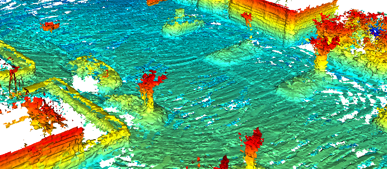

# Poisson Surface Reconstruction for LiDAR Odometry and Mapping <!-- omit in toc -->

|        Surfels         |          TSDF          |      Our Approach      |
| :--------------------: | :--------------------: | :--------------------: |
|  |  |  |

Table: Qualitative comparison between the different mapping techniques for
sequence `00` of the KITTI odometry benchmark.

This repository implements the algorithms described in our paper [Poisson
Surface Reconstruction for LiDAR Odometry and Mapping][paper].

This is a LiDAR Odometry and Mapping pipeline that uses the [Poisson Surface
Reconstruction][psr] algorithm to build the map as a triangular mesh.

We propose a novel `frame-to-mesh` registration algorithm where we compute
the poses of the vehicle by estimating the 6 degrees of freedom of the LiDAR.
To achieve this, we project each scan to the triangular mesh by computing the
ray-to-triangle intersections between each point in the input scan and the
map mesh. We accelerate this ray-casting technique using a [python
wrapper][pyembree] of the [Intel® Embree][embree] library.

The main application of our research is intended for autonomous driving vehicles.

## Table of Contents <!-- omit in toc -->

- [Running the code](#running-the-code)
  - [Requirements: Install docker](#requirements-install-docker)
  - [Datasets](#datasets)
  - [Building the `apss` docker container](#building-the-apss-docker-container)
  - [Converting from `.bin` to `.ply`](#converting-from-bin-to-ply)
  - [Running the `puma` pipeline](#running-the-puma-pipeline)
  - [4) Inspecting the results](#4-inspecting-the-results)
- [Where to go next](#where-to-go-next)
- [Citation](#citation)

## Running the code

**NOTE:** All the commands assume you are working on this shared workspace,
therefore, first `cd apps/` before running anything.

### Requirements: Install docker

If you plan to use our [docker](docker/README.md) container you only need to
install [docker][docker] and [docker-compose][compose].

If you **don't want to use docker** and install `puma` locally you might want
to visit the [Installation Instructions](./INSTALL.md)

### Datasets

First, you need to indicate where are all your datasets, for doing so just:

```sh
export DATASETS=<full-path-to-datasets-location>
```

This env variable is shared between the docker container and your host
system(in a read-only fashion).

So far we've only tested our approach on the [KITTI Odometry
benchmark][kitti] dataset and the [Mai city dataset][mai-city]. Both
datasets are using a 64-beam Velodyne like LiDAR.

### Building the `apss` docker container

This container is in charge of running the [apss](./apps) and needs to be
built with your user and group id (so you can share files). Building this
container is straightforward thanks to the provided [Makefile](./Makefile):

```sh
make
```

**If** you want' to inspect the image you can get an interactive shell by
running `make run`, but it's not mandatory.

### Converting from `.bin` to `.ply`

All our apps use the [PLY][ply] which is also binary but has much
better support than just raw binary files. Therefore, you will need to
convert all your data before running any of the [apps](./apps/) available in
this repo.

```sh
docker-compose run --rm apps bash -c '\
    ./data_conversion/bin2ply.py \
    --dataset $DATASETS/kitti-odometry/dataset/ \
    --out_dir ./data/kitti-odometry/ply/ \
    --sequence 07
    '
```

Please change the `--dataset` option to point to where you have the KITTI
dataset.

### Running the `puma` pipeline

Go grab a coffee/mate, this will take some time...

```sh
docker-compose run --rm apps bash -c '\
    ./pipelines/slam/puma_pipeline.py  \
    --dataset ./data/kitti-odometry/ply \
    --sequence 07 \
    --n_scans 40
    '
```

### 4) Inspecting the results

The `pipelines/slam/puma_pipeline.py` will generate 3 files on your host sytem:

```sh
results
├── kitti-odometry_07_depth_10_cropped_p2l_raycasting.ply # <- Generated Model
├── kitti-odometry_07_depth_10_cropped_p2l_raycasting.txt # <- Estimated poses
└── kitti-odometry_07_depth_10_cropped_p2l_raycasting.yml # <- Configuration
```

You can open the `.ply` with [Open3D][open3d], [Meshlab][meshlab],
[CloudCompare][cloudcompare], or the tool you like the most.

## Where to go next

If you already installed [puma](./INSTALL.md) then it's time to look for the
[standalone apps](./apps/). These apps are executable command line
interfaces (CLI) to interact with the core puma code:

```sh
├── data_conversion
│   ├── bin2bag.py
│   ├── kitti2ply.py
│   ├── ply2bin.py
│   └── ros2ply.py
├── pipelines
│   ├── mapping
│   │   ├── build_gt_cloud.py
│   │   ├── build_gt_mesh_incremental.py
│   │   └── build_gt_mesh.py
│   ├── odometry
│   │   ├── icp_frame_2_frame.py
│   │   ├── icp_frame_2_map.py
│   │   └── icp_frame_2_mesh.py
│   └── slam
│       └── puma_pipeline.py
└── run_poisson.py
```

All the apps should have an usable command line interface, so if you need
help you only need to pass the `--help` flag to the app you wish to use. For
example let's see the help message of the data conversion app `bin2ply.py`
used above:

```text
Usage: bin2ply.py [OPTIONS]

  Utility script to convert from the binary form found in the KITTI odometry
  dataset to .ply files. The intensity value for each measurement is encoded
  in the color channel of the output PointCloud.

  If a given sequence it's specified then it assumes you have a clean copy
  of the KITTI odometry benchmark, because it uses pykitti. If you only have
  a folder with just .bin files the script will most likely fail.

  If no sequence is specified then it blindly reads all the *.bin file in
  the specified dataset directory

Options:
  -d, --dataset PATH   Location of the KITTI dataset  [default:
                       /home/ivizzo/data/kitti-odometry/dataset/]

  -o, --out_dir PATH   Where to store the results  [default:
                       /home/ivizzo/data/kitti-odometry/ply/]

  -s, --sequence TEXT  Sequence number
  --use_intensity      Encode the intensity value in the color channel
  --help               Show this message and exit.
```

## Citation

If you use this library for any academic work, please cite the original [paper][paper].

```bibtex
@inproceedings{vizzo2021icra,
author    = {I. Vizzo and X. Chen and N. Chebrolu and J. Behley and C. Stachniss},
title     = {{Poisson Surface Reconstruction for LiDAR Odometry and Mapping}},
booktitle = {Proc.~of the IEEE Intl.~Conf.~on Robotics \& Automation (ICRA)},
codeurl   = {https://github.com/PRBonn/puma/},
year      = 2021,
}
```

<!-- References -->

[kitti]: http://www.cvlibs.net/datasets/kitti/eval_odometry.php
[mai-city]: https://www.ipb.uni-bonn.de/data/mai-city-dataset/
[ply]: https://en.wikipedia.org/wiki/PLY_(file_format)
[paper]: http://www.ipb.uni-bonn.de/wp-content/papercite-data/pdf/vizzo2021icra.pdf
[psr]: http://sites.fas.harvard.edu/~cs277/papers/poissonrecon.pdf
[pyembree]: https://github.com/scopatz/pyembree
[embree]: https://www.embree.org/
[gicp]: https://github.com/nachovizzo/Open3D/tree/nacho/generalized_icp
[open3d]: http://www.open3d.org/
[meshlab]: https://www.meshlab.net/
[cloudcompare]: https://www.danielgm.net/cc/
[compose]: https://docs.docker.com/compose/install/
[docker]: https://docs.docker.com/get-docker/
